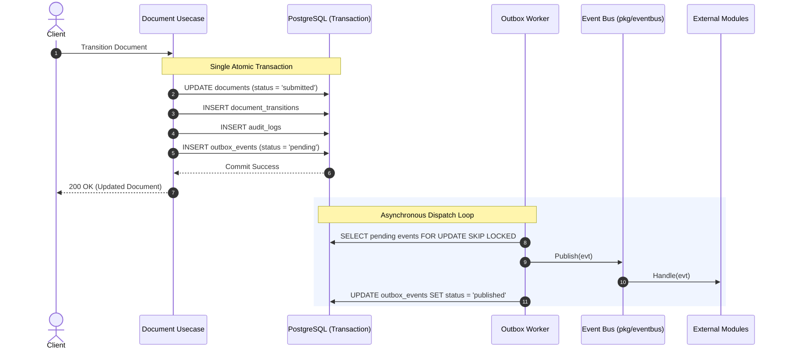

# Audit Trail & Transactional Outbox Engine

This document details the architecture, design patterns, and REST API for the **Audit Trail** and **Domain Event / Transactional Outbox Engine** in Mergiate Core.

---

## 1. Architectural Motivation

In modern ERP platforms, two invariants are critical for enterprise reliability:
1. **Immutable Auditability**: Every state mutation (creations, edits, status transitions) must be permanently logged for forensic analysis, compliance, and user accountability.
2. **Transactional Event Durability (Zero Message Loss)**: External modules (e.g. Sales, Inventory, Accounting plugins) must be notified of core domain occurrences (such as `document.created` or `document.transitioned`) reliably without dual-write inconsistency risks.

---

## 2. Audit Trail (`audit_logs`)

### Data Model & Invariants
- **Append-only**: No update or delete operations are exposed on audit tables.
- **Actor Identity**: Identifies who initiated the mutation (`user`, `system`, or `api_key`).
- **Entity Agnostic**: Records actions against any aggregate (`document`, `party`, `product`, `organization`, `tenant`).
- **Structured Changes**: State diffs or snapshots stored in `changes` (JSONB).
- **Audit Metadata**: Request details (IP, user agent, request trace ID) stored in `metadata` (JSONB).

### Query API
- `GET /api/v1/audit-logs`:
  - `entity_type` (e.g. `document`)
  - `entity_id` (target UUID)
  - `actor_id` (actor UUID)
  - `action` (`create`, `update`, `delete`, `transition`)
  - `page` & `page_size`

```bash
curl -X GET "http://localhost:8088/api/v1/audit-logs?entity_type=document&entity_id=<DOC_UUID>" \
  -H "X-Tenant-ID: <TENANT_UUID>"
```

---

## 3. Transactional Outbox Pattern & Event Bus

### The Dual-Write Problem
In distributed systems, writing to a database and publishing directly to a message broker (e.g. Redis / RabbitMQ / Kafka) in separate steps risks inconsistency: if the database commits but the network fails before publishing, the event is permanently lost.

### Mergiate's Outbox Solution


### Event Schema
Every event adheres to a unified contract:
- `id` (UUIDv7)
- `tenant_id` (UUIDv7)
- `event_type` (`document.created`, `document.transitioned`, `party.created`, etc.)
- `aggregate_type` (`document`, `party`, etc.)
- `aggregate_id` (UUIDv7)
- `payload` (JSONB containing contextual event data)
- `created_at` (TIMESTAMPTZ)

---

## 4. Subscribing to Events (Plugin & Module Integration)

Modules subscribe via the `event.Bus` interface:

```go
bus.Subscribe("document.transitioned", func(ctx context.Context, evt event.Event) error {
    payload := evt.Payload()
    toStatus := payload["to_status"].(string)
    
    if toStatus == "approved" {
        // e.g. Trigger inventory stock allocation or invoice generation
    }
    return nil
})

// Wildcard subscriptions are also supported:
bus.Subscribe("document.*", func(ctx context.Context, evt event.Event) error {
    // Catch-all for all document lifecycle changes
    return nil
})
```
