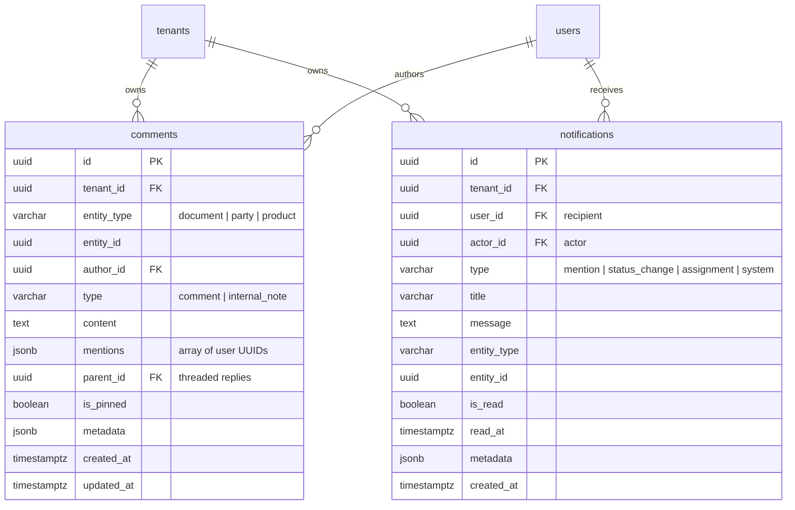

# Communication & Collaboration Engine

This document details the architecture, data models, notification dispatching, and REST API for the **Multi-Tenant Communication, Comments, In-App Notifications, & Unified Activity Timeline** in Mergiate Core (fulfilling **Bagian H of the Core Platform Blueprint**).

---

## 1. Architectural Motivation & Invariants

ERP systems are collaborative by nature. Teams working across procurement, inventory, sales, and finance need:
- Contextual discussions attached directly to documents, business partners, and catalog items.
- Distinction between public collaboration comments and confidential internal notes (e.g. finance margin notes, credit review comments).
- Mentions (`@user`) with automated in-app notifications.
- A single, unified chronological activity feed on any entity screen, combining audit logs, comments, and file attachments.

Decoupling Principle:
- Core handles internal primitives: `comments`, `notifications`, `activities`.
- External delivery channels (WhatsApp, Email, Telegram, SMS) are **intentionally not hardcoded into Core**. Instead, domain events `comment.created` and `notification.created` are written to the Transactional Outbox and broadcast over the Event Bus for dedicated worker/channel plugins to process.

---

## 2. Data Model & Storage



---

## 3. Unified Activity Timeline

The `/api/v1/activities/{entityType}/{entityId}` endpoint aggregates 3 discrete event streams into a single chronologically sorted timeline:
1. **Audit Logs (`audit_logs`)**: Status changes and lifecycle workflow transitions.
2. **Comments & Notes (`comments`)**: Team messages and pinned internal notes.
3. **Attachments (`entity_attachments`)**: Uploaded and linked files.

```json
[
  {
    "id": "01a09f2c-c3cb-7429-9be3-06d6a564aecb",
    "timestamp": "2026-09-14T16:08:26Z",
    "activity_type": "comment",
    "actor_id": "01a09f2c-c237-7d32-b277-ca4030a5cf6c",
    "actor_name": "Author User",
    "title": "Added an internal note",
    "description": "Confidential: Margin approved by finance at 18%.",
    "payload": {
      "comment_type": "internal_note",
      "is_pinned": true
    }
  },
  {
    "id": "01a09f2c-c39c-7d55-9867-02f633bb1a72",
    "timestamp": "2026-09-14T16:08:26Z",
    "activity_type": "audit",
    "title": "Status / Operation: create",
    "description": "Action: create",
    "payload": {
      "status": "draft",
      "document_number": "QUO-COMM-001"
    }
  }
]
```

---

## 4. REST API Reference

All requests require multi-tenant context via `X-Tenant-ID` header or JWT Bearer Token.

### 1. Add Comment / Internal Note
`POST /api/v1/comments`

```json
{
  "entity_type": "document",
  "entity_id": "01a09f2c-c390-7219-9168-4bd90cef9ba1",
  "type": "comment",
  "content": "Please review this quotation @01a09f2c-c306-772b-a983-82abdafdb195",
  "mentions": ["01a09f2c-c306-772b-a983-82abdafdb195"]
}
```

### 2. List Entity Comments
`GET /api/v1/comments/{entityType}/{entityId}`

Returns comments joined with author metadata (`author_name`, `author_email`), sorted by pinned status and creation date.

### 3. Delete Comment
`DELETE /api/v1/comments/{id}`

Authors can delete their own comments; users with administrative permissions can delete any comment.

### 4. List User Notifications
`GET /api/v1/notifications?unread_only=true&limit=20`

Returns paginated notifications and total unread count.

### 5. Mark Notification as Read
`POST /api/v1/notifications/{id}/read`

### 6. Mark All Notifications as Read
`POST /api/v1/notifications/read-all`

### 7. Unified Activity Feed
`GET /api/v1/activities/{entityType}/{entityId}`
