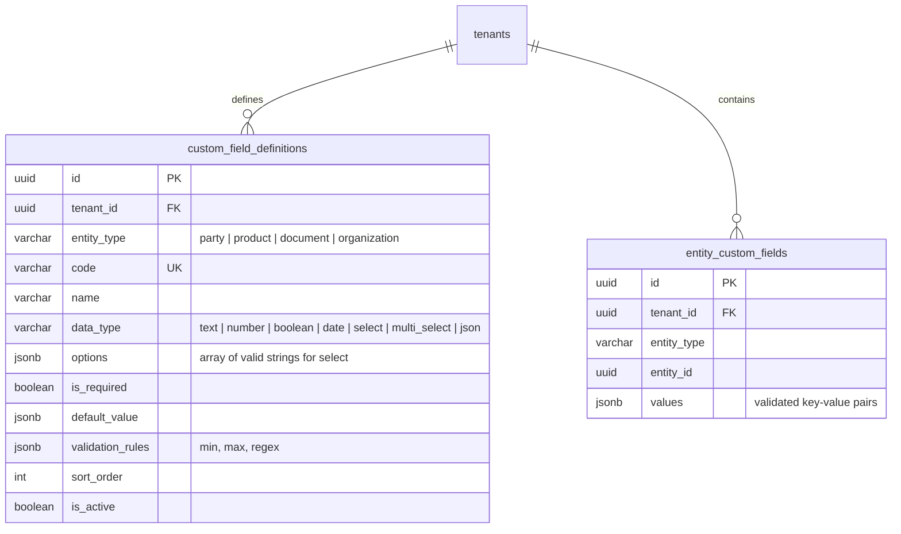

# Custom Field & Metadata Extension Engine

This document details the architecture, design decisions, data models, validation engine, and REST API for the **Custom Field & Metadata Extension Engine** in Mergiate Core (fulfilling **Rule 6 of the 7 Architectural Invariants**).

---

## 1. Architectural Motivation & Invariants

> **Core Invariant Rule 6**: *"Custom Fields are the Extension Mechanism: Ad-hoc business attributes are supported via typed definitions to prevent schema pollution in core tables."*

In modern ERP and business platforms, different tenants and industry verticals require domain-specific attributes:
- A fashion retailer needs `fabric_type` and `care_instructions` on Products.
- An electronics manufacturer needs `serial_number_format` and `warranty_months`.
- A medical supplier needs `sterilization_expiry` and `fda_registration_id`.

Instead of adding dozens of nullable columns to core tables or relying on untyped, chaotic JSON blobs, Mergiate Core implements a **Hybrid Schema Definition + Dedicated Entity Storage with GIN Indexing**:
1. **Schema Definitions (`custom_field_definitions`)**: Defined per-tenant and per-target entity (`party`, `product`, `document`, `organization`), specifying data types, required constraints, and validation rules.
2. **Dedicated Entity Values (`entity_custom_fields`)**: Validated values are stored as a JSONB map keyed by field code in a single row per entity, indexed with PostgreSQL GIN (`USING GIN(values)`).
3. **Clean Separation**: Custom fields store user and module business attributes, keeping the existing `metadata JSONB` column dedicated to internal/trace/ephemeral data.

---

## 2. Data Model & Storage



### Supported Data Types & Validation Rules

| Data Type | Go / JSON Type | Validations Supported | Example |
|---|---|---|---|
| `text` | `string` | `regex` pattern, non-empty if required | `"Cotton 100%"` |
| `number` | `float64 / int` | `min`, `max` boundaries | `24` |
| `boolean` | `bool` | Strict boolean value | `true` |
| `date` | `string` (ISO) | `YYYY-MM-DD` format verification | `"2026-12-31"` |
| `select` | `string` | Must be an element of `options` list | `"Navy"` |
| `multi_select` | `[]string` | Every element must exist in `options` | `["Waterproof", "Insulated"]` |
| `json` | `any` | Valid JSON object or array | `{"specs": {"weight": 1.2}}` |

---

## 3. REST API Reference

### A. Field Definitions

#### 1. Create Field Definition
```http
POST /api/v1/custom-fields/definitions
Authorization: Bearer <TOKEN>
X-Tenant-ID: <TENANT_UUID>
Content-Type: application/json

{
  "entity_type": "product",
  "code": "warranty_months",
  "name": "Warranty in Months",
  "data_type": "number",
  "is_required": true,
  "validation_rules": {
    "min": 0,
    "max": 60
  }
}
```

#### 2. List Definitions by Entity
```http
GET /api/v1/custom-fields/definitions?entity_type=product
Authorization: Bearer <TOKEN>
X-Tenant-ID: <TENANT_UUID>
```

#### 3. Update Definition
```http
PUT /api/v1/custom-fields/definitions/{id}
Authorization: Bearer <TOKEN>
X-Tenant-ID: <TENANT_UUID>
Content-Type: application/json

{
  "name": "Warranty Period (Months)",
  "is_required": false
}
```

#### 4. Delete Definition
```http
DELETE /api/v1/custom-fields/definitions/{id}
Authorization: Bearer <TOKEN>
X-Tenant-ID: <TENANT_UUID>
```

---

### B. Entity Values

#### 1. Set / Update Entity Custom Fields
```http
PUT /api/v1/custom-fields/values/{entity_type}/{entity_id}
Authorization: Bearer <TOKEN>
X-Tenant-ID: <TENANT_UUID>
Content-Type: application/json

{
  "values": {
    "warranty_months": 24,
    "color_shade": "Navy",
    "is_fragile": true
  }
}
```
*Note: Any payload violating schema definitions (e.g. missing required field, out-of-range number, or invalid select option) will be rejected with `HTTP 400 Bad Request`.*

#### 2. Get Entity Custom Fields
```http
GET /api/v1/custom-fields/values/{entity_type}/{entity_id}
Authorization: Bearer <TOKEN>
X-Tenant-ID: <TENANT_UUID>
```

---

## 4. High Performance GIN Indexing & Querying

All custom field values are indexed with a PostgreSQL GIN index on `entity_custom_fields.values`:

```sql
CREATE INDEX idx_entity_custom_fields_values 
    ON entity_custom_fields USING GIN (values);
```

This enables sub-millisecond JSONB containment queries across millions of records without full-table scans:

```sql
SELECT entity_id, values 
FROM entity_custom_fields 
WHERE tenant_id = '01a09eca-a57a-7120-aa80-362e667abc30'
  AND entity_type = 'product'
  AND values @> '{"color_shade": "Navy", "is_fragile": true}';
```
