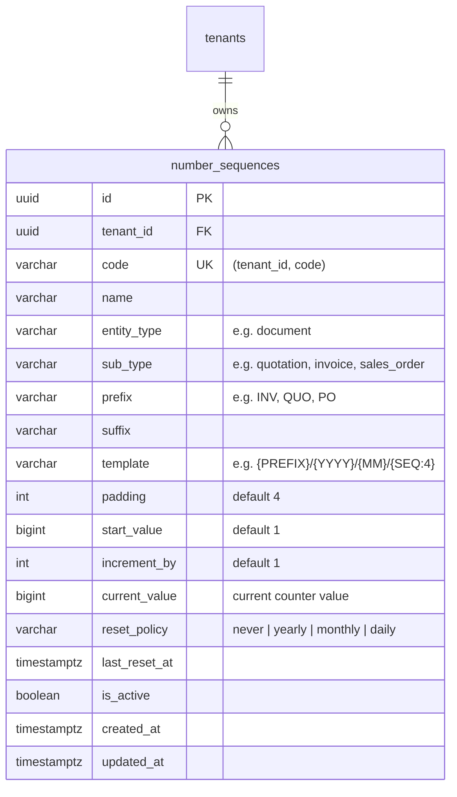
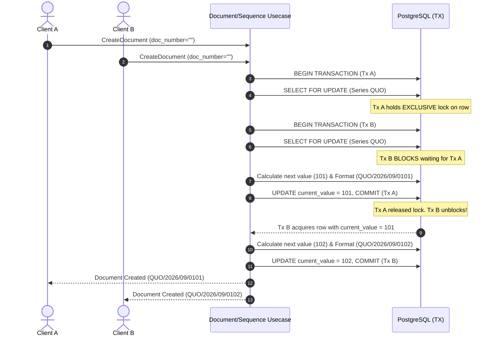

# Document Numbering & Sequence Engine

This document details the architecture, design decisions, data models, concurrency control, token templating, and REST API for the **Enterprise Auto-Numbering & Sequence Engine** in Mergiate Core.

---

## 1. Architectural Motivation

In multi-tenant ERP and commerce platforms, business documents (Quotations, Sales Orders, Invoices, Delivery Orders, Purchase Orders) require sequential, tenant-isolated, and auditor-friendly numbering schemes.

Key operational requirements:
1. **Concurrency Safety & No Duplicates**: High-frequency concurrent requests must not generate collisions or duplicate document numbers.
2. **Dynamic Format Templating**: Support prefixes, suffixes, dates (`YYYY`, `YY`, `MM`, `DD`), zero-padding (`{SEQ:N}`), and organization codes (`{ORG}`).
3. **Rolling Counter Resets**: Automatic reset policies based on time cycles (`never`, `yearly`, `monthly`, `daily`) based on `last_reset_at`.
4. **Transparent Core Integration**: When a document is created with an empty `document_number`, the document usecase automatically acquires the next sequential identifier from the configured sequence series. If no sequence is defined, it safely falls back to a deterministic timestamp-based numbering format.

---

## 2. Data Model & Storage



### Unique Constraints
- `(tenant_id, code)`: Unique identifier for programmatic series lookup.
- `(tenant_id, entity_type, sub_type)`: Default sequence mapping per document category (e.g. `document` + `quotation`).

---

## 3. Concurrency Safety: Atomic Row Locking

To prevent race conditions during high-volume document generation:
- The repository acquires the sequence within a database transaction using **PostgreSQL row locking**:
  ```sql
  SELECT * FROM number_sequences
  WHERE tenant_id = $1 AND entity_type = $2 AND sub_type = $3 AND is_active = true
  FOR UPDATE;
  ```
- Any concurrent transaction attempting to acquire a number for the same series will block until the active transaction commits or rolls back.
- Counter increment and `last_reset_at` updates are committed atomically.



---

## 4. Template Engine & Supported Tokens

Templates use curly brace `{TOKEN}` syntax. Unknown tokens are safely replaced with provided extra contextual tokens or left uncorrupted.

| Token | Description | Example Output |
|---|---|---|
| `{PREFIX}` | Configured prefix of the sequence | `QUO` |
| `{SUFFIX}` | Configured suffix of the sequence | `TAX` |
| `{YYYY}` | 4-digit current year | `2026` |
| `{YY}` | 2-digit current year | `26` |
| `{MM}` | 2-digit zero-padded current month | `09` |
| `{DD}` | 2-digit zero-padded current day of month | `14` |
| `{SEQ}` | Zero-padded sequence number using series `padding` | `0042` |
| `{SEQ:N}` | Explicit N-digit zero-padded sequence number | `{SEQ:6}` -> `000042` |
| `{ORG}` | Organization / Branch code from context | `HQ`, `SBY01` |

### Example Templates & Outputs

| Template Pattern | Counter | Result |
|---|---|---|
| `{PREFIX}/{YYYY}/{MM}/{SEQ:4}` | 1 | `QUO/2026/09/0001` |
| `INV-{YY}{MM}-{SEQ:5}` | 42 | `INV-2609-00042` |
| `PO/{ORG}/{YYYY}/{SEQ:4}` (`ORG=SBY`) | 7 | `PO/SBY/2026/0007` |

---

## 5. Rolling Reset Policies

When `NextValue(now)` is evaluated, the engine inspects `last_reset_at`:
- **`never`**: Counter increments indefinitely without resetting.
- **`yearly`**: If `now.Year() != last_reset_at.Year()`, counter resets to `start_value`.
- **`monthly`**: If `now.Year() != last_reset_at.Year()` or `now.Month() != last_reset_at.Month()`, counter resets.
- **`daily`**: If `now.Truncate(24h) != last_reset_at.Truncate(24h)`, counter resets.

---

## 6. Document Engine Integration & Fallback

When `docUsecase.CreateDocument` is called:
```go
if cmd.DocumentNumber == "" {
    if u.sequenceUsecase != nil {
        num, err := u.sequenceUsecase.AcquireNextNumber(ctx, sequence.AcquireNextCommand{
            TenantID:   tenantID,
            EntityType: "document",
            SubType:    string(cmd.DocumentType),
            ExtraTokens: map[string]string{
                "ORG": orgCode,
            },
        })
        if err == nil && num != "" {
            cmd.DocumentNumber = num
        }
    }

    // Deterministic fallback if sequence not configured
    if cmd.DocumentNumber == "" {
        cmd.DocumentNumber = fmt.Sprintf("DOC-%s-%s", strings.ToUpper(string(cmd.DocumentType)), time.Now().Format("20060102-150405"))
    }
}
```

---

## 7. REST API Endpoints

All endpoints require multi-tenant context via `X-Tenant-ID` header or JWT Bearer Token.

### 1. Create Sequence Definition
`POST /api/v1/sequences`
```json
{
  "code": "quo-series",
  "name": "Standard Quotations",
  "entity_type": "document",
  "sub_type": "quotation",
  "prefix": "QUO",
  "suffix": "",
  "template": "{PREFIX}/{YYYY}/{MM}/{SEQ:4}",
  "reset_policy": "yearly",
  "current_value": 0,
  "step": 1,
  "padding": 4
}
```

### 2. Preview Sequence Number (Read-Only)
`POST /api/v1/sequences/preview`
```json
{
  "entity_type": "document",
  "sub_type": "quotation"
}
```
**Response (200 OK)**:
```json
{
  "success": true,
  "data": {
    "preview": "QUO/2026/09/0001"
  }
}
```

### 3. Acquire Next Number Directly
`POST /api/v1/sequences/next`
```json
{
  "entity_type": "document",
  "sub_type": "quotation",
  "extra_tokens": {
    "ORG": "HQ"
  }
}
```
**Response (200 OK)**:
```json
{
  "success": true,
  "data": {
    "number": "QUO/2026/09/0001"
  }
}
```

### 4. List Sequences
`GET /api/v1/sequences`

### 5. Get Sequence Details
`GET /api/v1/sequences/{id}`

### 6. Update Sequence Definition
`PUT /api/v1/sequences/{id}`

### 7. Delete Sequence
`DELETE /api/v1/sequences/{id}`
