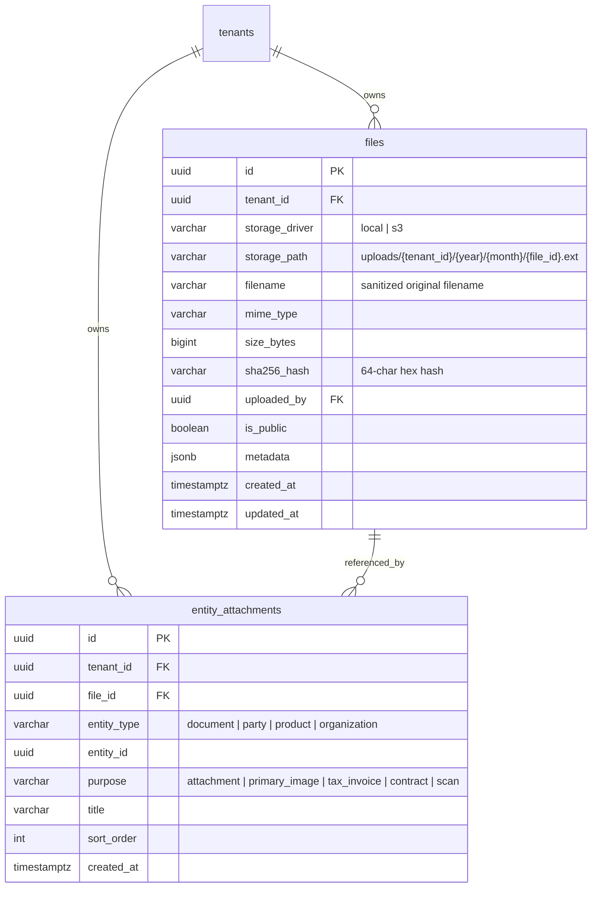

# File & Attachment Engine

This document details the architecture, data models, pluggable storage driver abstraction, and REST API for the **Multi-Tenant File & Attachment Engine** in Mergiate Core (fulfilling **Bagian G of the Core Platform Blueprint**).

---

## 1. Architectural Motivation & Invariants

In modern ERP and business applications, almost all domain entities and pluggable modules require file attachments:
- **Documents**: Invoices (PDF), scanned purchase orders, signed sales contracts, receipts.
- **Parties**: ID card scans (KTP/Passport), tax registration documents (NPWP/NIB), company profiles.
- **Products**: Catalog images, technical specification PDFs, user manuals, brochures.
- **HR & Employees**: Employee resumes, educational certificates, signed labor contracts.

Mergiate Core adopts a **Two-Tier Architecture (`files` + `entity_attachments`)**:
1. **Physical File Assets (`files`)**: Isolates storage mechanics, directory paths, MIME types, byte sizes, and cryptographic integrity hashes (`SHA-256`).
2. **Polymorphic Entity Attachments (`entity_attachments`)**: Associates files with any business entity (`document`, `party`, `product`, `organization`, etc.) with purpose tags (`primary_image`, `tax_invoice`, `contract`, `scan`) and sorting order.
3. **Pluggable Storage Driver (`pkg/storage/driver.go`)**: Decouples application logic from the underlying storage infrastructure, enabling transparent switching between Local Disk and S3-compatible cloud storage (AWS S3, MinIO, Cloudflare R2, Wasabi).

---

## 2. Data Model & Storage



### Supported Purposes
- `attachment`: General purpose document attachment (default).
- `primary_image`: Featured product image or party avatar.
- `tax_invoice`: Official tax document (Faktur Pajak).
- `contract`: Signed legal contract or terms agreement.
- `scan`: Physical paper receipt or document scan.

---

## 3. Pluggable Storage Driver (`pkg/storage`)

```go
type Driver interface {
    Put(ctx context.Context, path string, r io.Reader, size int64, contentType string) error
    Get(ctx context.Context, path string) (io.ReadCloser, error)
    Delete(ctx context.Context, path string) error
    Exists(ctx context.Context, path string) (bool, error)
    GetURL(ctx context.Context, path string, expiry time.Duration) (string, error)
}
```

### Local Storage Implementation (`pkg/storage/local`)
- Default directory: `./storage/uploads/` (configurable).
- **Security**: Built-in path traversal defense (`filepath.Clean` + root boundary verification).
- **Reliability**: Writes to temporary file (`upload-*.tmp`) and commits atomically via `os.Rename`.

---

## 4. REST API Reference

All requests require multi-tenant context via `X-Tenant-ID` header or JWT Bearer Token.

### 1. Upload File
`POST /api/v1/files/upload` (Multipart Form)

**Form Fields**:
- `file`: Binary file stream (Required).
- `is_public`: Boolean string `"true"|"false"` (Optional).

**Response (201 Created)**:
```json
{
  "success": true,
  "data": {
    "id": "01a09f23-a3ab-77b8-9630-c0c4b083569b",
    "tenant_id": "01a09f23-a2ef-7b4d-bdae-eef7151c7677",
    "storage_driver": "local",
    "storage_path": "uploads/01a09f23-a2ef-7b4d-bdae-eef7151c7677/2026/09/01a09f23-a3ab-77b8-9630-c0c4b083569b.pdf",
    "filename": "quotation_contract.pdf",
    "mime_type": "application/pdf",
    "size_bytes": 1048576,
    "sha256_hash": "a6dcbc06dae4db312386b28e4881783b9a6c3bf1cd50e73a3e4b6f3d9abb0b22",
    "is_public": false,
    "created_at": "2026-09-14T15:58:28Z",
    "updated_at": "2026-09-14T15:58:28Z"
  }
}
```

### 2. Download File
`GET /api/v1/files/{id}/download`

Optional query parameter `?disposition=attachment` forces browser download dialog. Defaults to `inline`.

### 3. Get File Metadata
`GET /api/v1/files/{id}`

### 4. Delete Physical File
`DELETE /api/v1/files/{id}`

Purges the physical file from storage and removes database records (cascading to entity attachments).

### 5. Attach File to Entity
`POST /api/v1/attachments`

**Payload**:
```json
{
  "file_id": "01a09f23-a3ab-77b8-9630-c0c4b083569b",
  "entity_type": "document",
  "entity_id": "01a09f23-a3eb-7689-b92c-ee612ce898bd",
  "purpose": "signed_contract",
  "title": "Customer Signed Sales Order Contract",
  "sort_order": 1
}
```

### 6. List Attachments for Entity
`GET /api/v1/attachments/{entityType}/{entityId}`

Returns list of attachments joined with physical file metadata.

### 7. Detach File
`DELETE /api/v1/attachments/{id}`

Unlinks the attachment record without deleting the underlying physical file.
