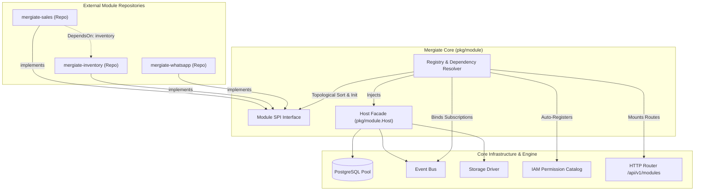

# Module & Plugin SPI Engine

Dokumentasi arsitektur dan panduan pengembangan modul bisnis eksternal untuk platform **Mergiate Core**.

---

## 1. Arsitektur & Core Invariant Rule 1

> **Core Invariant Rule 1**:
> *"Core Never Imports Modules: Modules import Core. Core defines extension points via interfaces/events. Modules never define Core behavior."*

Mergiate Core dirancang sebagai fondasi modular ERP. Core **tidak pernah** memiliki dependensi kode langsung ke modul first-party atau third-party spesifik (seperti Sales, Inventory, POS, WhatsApp Gateway, dsb). Sebaliknya, Core menyediakan **Service Provider Interface (SPI)** di paket `pkg/module` yang diimpor oleh modul-modul yang berada di repository terpisah.



---

## 2. SPI Contracts (`pkg/module`)

### A. Interface `module.Module`

Setiap modul wajib mengimplementasikan interface ini:

```go
package module

import (
    "context"
    "github.com/go-chi/chi/v5"
)

type Module interface {
    // Manifest mengembalikan metadata modul dan deklarasi dependensi.
    Manifest() Manifest

    // Init menginisialisasi modul menggunakan Core Host facade.
    Init(ctx context.Context, host Host) error

    // RegisterRoutes mendaftarkan HTTP endpoint modul.
    // Otomatis di-mount di /api/v1/modules/{manifest.Name}/*
    RegisterRoutes(r chi.Router)

    // Permissions mendefinisikan permission RBAC baru untuk didaftarkan ke IAM Core.
    Permissions() []PermissionDefinition

    // Subscriptions mendefinisikan event listener yang di-bind ke Event Bus Core.
    Subscriptions() []Subscription

    // Shutdown membersihkan background worker, goroutine, atau resource modul.
    Shutdown(ctx context.Context) error
}
```

### B. Struct `Manifest`

```go
type Manifest struct {
    Name        string   `json:"name"`                   // Slug unik modul (e.g. "sales", "inventory")
    Version     string   `json:"version"`                // Semantic versioning (e.g. "1.0.0")
    Title       string   `json:"title"`                  // Nama modul untuk display
    Description string   `json:"description"`            // Penjelasan singkat fitur
    Author      string   `json:"author,omitempty"`       // Nama developer / agensi
    Website     string   `json:"website,omitempty"`      // Link repo / docs
    DependsOn   []string `json:"depends_on,omitempty"`   // Modul lain yang wajib di-init duluan
}
```

### C. Facade `module.Host`

Modul tidak mengakses internal Core secara bebas, melainkan melalui facade yang aman dan terkontrol:

```go
type Host interface {
    DB() *pgxpool.Pool
    EventBus() eventbus.Bus
    Storage() storage.Driver
    TokenManager() auth.TokenManager
    Logger() *slog.Logger
    RecordOutbox(ctx context.Context, tenantID shared.ID, eventType, aggregateType string, aggregateID shared.ID, payload map[string]any) error
}
```

---

## 3. Fitur Utama SPI Engine

### 1. Topological Sorting & Cycle Detection (Kahn's Algorithm)
Jika modul `sales` bergantung pada modul `inventory`, dan `inventory` bergantung pada `warehouse`, Registry secara otomatis mengurutkan inisialisasi:
$$\text{warehouse} \to \text{inventory} \to \text{sales}$$

Jika terdapat dependensi melingkar (misalnya $A \to B \to A$), Registry menolak saat startup dengan error `ErrCircularDependency`. Begitu juga jika ada modul yang bergantung pada modul yang belum terpasang (`ErrModuleNotFound`).

### 2. Reverse Graceful Shutdown
Saat Core menerima sinyal `SIGINT` / `SIGTERM`, modul di-shutdown dengan urutan terbalik dari inisialisasinya:
$$\text{sales} \to \text{inventory} \to \text{warehouse}$$
Hal ini memastikan konsumen terhenti terlebih dahulu sebelum layanan dasar atau dependensinya dimatikan.

### 3. Otomatisasi Pendaftaran Permissions
Setiap permission yang dikembalikan oleh `module.Permissions()` secara otomatis dimasukkan ke tabel `permissions` di database Core melalui query idempotent `ON CONFLICT (code) DO UPDATE`, sehingga admin tenant dapat langsung menugaskan permission modul ke role user di Core IAM.

### 4. Event-Driven Decoupling
Modul dapat mendaftarkan `Subscriptions()`:
```go
func (m *SalesModule) Subscriptions() []module.Subscription {
    return []module.Subscription{
        {
            Pattern: "document.status_changed",
            Handler: m.onDocumentStatusChanged,
        },
    }
}
```
Registry mengikat seluruh subscription ke `EventBus` saat booting.

### 5. Dynamic Route Namespacing & Discovery
- **Discovery Endpoint**: `GET /api/v1/modules` mengembalikan daftar metadata modul aktif yang terpasang.
- **Route Isolation**: Semua endpoint yang didaftarkan di `RegisterRoutes(r)` secara otomatis di-mount di sub-path:
  ```
  /api/v1/modules/{module_name}/*
  ```
  Contoh: Modul `billing` yang meregistrasikan `r.Post("/invoices", ...)` akan dapat diakses di `/api/v1/modules/billing/invoices`.

---

## 4. Panduan: Membuat Modul di Repo Terpisah

### Langkah 1: Inisialisasi Repo Baru
```bash
mkdir mergiate-sales && cd mergiate-sales
go mod init github.com/akordium-id/mergiate-sales
go get github.com/akordium-id/mergiate-core@main
```

### Langkah 2: Implementasikan `module.Module`
```go
package sales

import (
    "context"
    "net/http"

    "github.com/go-chi/chi/v5"
    "github.com/akordium-id/mergiate-core/pkg/eventbus"
    "github.com/akordium-id/mergiate-core/pkg/module"
    "github.com/akordium-id/mergiate-core/pkg/response"
)

type SalesModule struct {
    host module.Host
}

func New() module.Module {
    return &SalesModule{}
}

func (m *SalesModule) Manifest() module.Manifest {
    return module.Manifest{
        Name:        "sales",
        Version:     "1.0.0",
        Title:       "Sales Management",
        Description: "Sales quotations, sales orders, and customer management",
        Author:      "Akordium Lab",
        DependsOn:   []string{}, // Atau []string{"inventory"} jika butuh stok
    }
}

func (m *SalesModule) Init(ctx context.Context, host module.Host) error {
    m.host = host
    // Inisialisasi repository, usecase, dan service modul menggunakan host.DB(), dsb.
    return nil
}

func (m *SalesModule) RegisterRoutes(r chi.Router) {
    // Endpoint ini akan berada di: /api/v1/modules/sales/orders
    r.Get("/orders", func(w http.ResponseWriter, r *http.Request) {
        response.JSON(w, http.StatusOK, map[string]string{
            "status": "sales active",
        })
    })
}

func (m *SalesModule) Permissions() []module.PermissionDefinition {
    return []module.PermissionDefinition{
        {
            Code:        "sales:order:read",
            Name:        "Read Sales Orders",
            Category:    "sales",
            Description: "View sales orders and history",
        },
        {
            Code:        "sales:order:create",
            Name:        "Create Sales Order",
            Category:    "sales",
            Description: "Draft and submit new sales orders",
        },
    }
}

func (m *SalesModule) Subscriptions() []module.Subscription {
    return []module.Subscription{
        {
            Pattern: "document.status_changed",
            Handler: func(ctx context.Context, evt eventbus.Event) error {
                m.host.Logger().Info("sales received document status event", "id", evt.AggregateID())
                return nil
            },
        },
    }
}

func (m *SalesModule) Shutdown(ctx context.Context) error {
    // Cleanup background tasks
    return nil
}
```

### Langkah 3: Menghubungkan Modul ke Server Main (Custom Distro / Binary)
Di aplikasi runner atau distro server:
```go
import (
    "github.com/akordium-id/mergiate-sales"
)

func main() {
    // ... setup host & registry
    registry := module.NewRegistry(host)

    // Daftarkan modul eksternal
    registry.Register(sales.New())

    // Inisialisasi
    registry.InitAll(ctx)
    registry.RegisterPermissions(ctx)
    registry.BindSubscriptions()
    // ...
}
```
Core tetap bebas dari dependensi statis modul apa pun!
