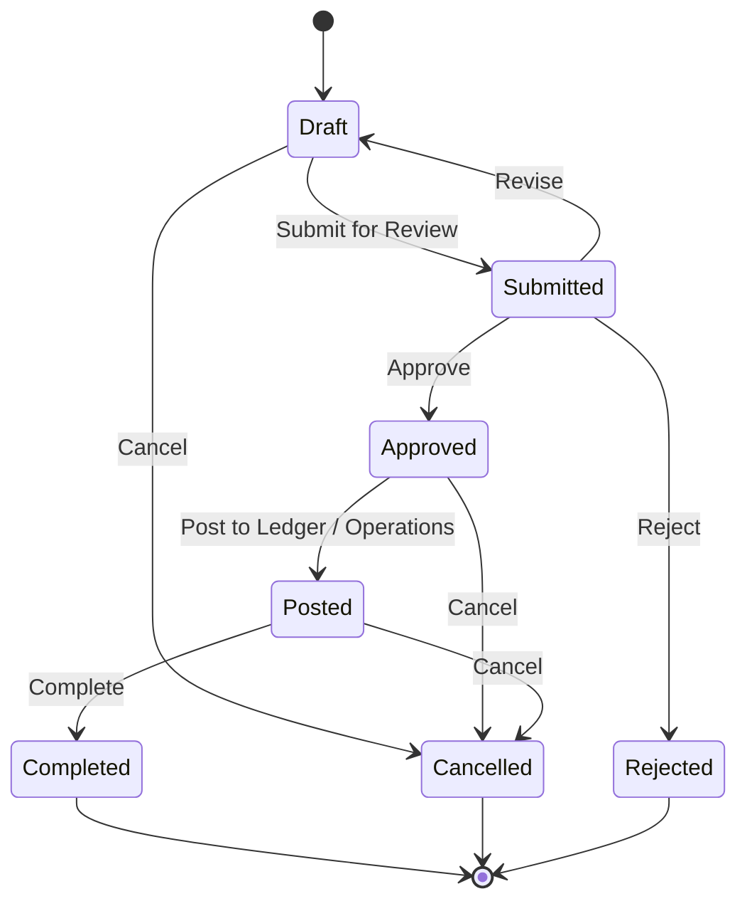

# Product & Generic Document Core

This document outlines the design, architecture, and API usage for **Product & Unit of Measure (UoM)** and the **Generic Business Document Engine** in Mergiate Core.

---

## 1. Product & Unit of Measure (UoM) Core

In modern ERP systems, items are traded in varying packaging sizes (e.g. Piece, Box, Carton, Pallet) and metric measures (e.g. Kilogram, Gram, Liter).

Mergiate provides:
1. **Unit**: Master definitions of units of measure (`PCS`, `BOX`, `KG`, `G`, `M`).
2. **Unit Conversion**: Linear multipliers between units (`from_unit * factor = to_unit`).
3. **Multi-hop Graph Path Finding**: When converting from `PALLET` to `PCS` where only `PALLET -> BOX (10)` and `BOX -> PCS (12)` are defined, Mergiate's BFS conversion engine automatically traverses the graph and calculates `1 PALLET = 120 PCS` (and vice-versa for inverse conversions).
4. **Product**: High-level catalogue item supporting `goods` and `services`.
5. **ProductVariant**: Sub-SKUs for options like roast level, size, or color, maintaining SKU uniqueness per tenant.

### API Endpoints
- `POST /api/v1/units` — Create unit of measure
- `GET /api/v1/units` — List tenant units
- `POST /api/v1/units/conversions` — Define conversion multiplier
- `POST /api/v1/units/convert` — Execute unit conversion (`{ amount, from_unit_id, to_unit_id }`)
- `POST /api/v1/products` — Register product
- `GET /api/v1/products` — Filter & paginate products
- `POST /api/v1/products/{id}/variants` — Add product variant

---

## 2. Generic Document Aggregate & Workflow Engine

Rather than coupling the core to rigid tables for every transaction type, Mergiate Core provides a **Universal Document Aggregate** designed to support:
- `sales_order` (Sales Orders)
- `invoice` (Commercial Invoices)
- `purchase_order` (Purchase Orders)
- `quotation` (Quotations & Estimates)
- `delivery_note` (Goods Delivery)

### Document Structure & Invariants
- **Header**: Contains tenant isolation, issuing organization, external party (customer/supplier), document number, document date, notes, and metadata.
- **Lines**: Line items with product references, description, quantity, unit, unit price (Money VO), and computed subtotal.
- **Total Amount**: Guaranteed by domain calculation: `TotalAmount = Sum(Subtotals)`. Ensures precision and currency uniformity.

### Workflow State Machine
Documents follow a strict transition lifecycle enforced by the domain engine:



### Audit Trail (`document_transitions`)
Every transition is permanently recorded with:
- `from_status` and `to_status`
- `reason` (audit note)
- `actor_id` (user or system actor)
- `created_at` (immutable timestamp)

---

## 3. Quickstart API Examples

### Create a Sales Order with Line Items
```bash
curl -X POST http://localhost:8088/api/v1/documents \
  -H "Content-Type: application/json" \
  -H "X-Tenant-ID: <TENANT_UUID>" \
  -d '{
    "organization_id": "<ORG_UUID>",
    "document_type": "sales_order",
    "document_number": "SO-2026-0001",
    "party_id": "<CUSTOMER_PARTY_UUID>",
    "currency": "IDR",
    "notes": "Express roastery delivery",
    "lines": [
      {
        "product_id": "<PRODUCT_UUID>",
        "description": "Single Origin Espresso Beans 1kg",
        "quantity": 10,
        "unit_id": "<BOX_UNIT_UUID>",
        "unit_price": {"amount": 150000, "currency": "IDR"}
      },
      {
        "description": "Logistics & Delivery Handling",
        "quantity": 1,
        "unit_id": "<PCS_UNIT_UUID>",
        "unit_price": {"amount": 50000, "currency": "IDR"}
      }
    ]
  }'
```

### Transition Workflow Status
```bash
curl -X POST http://localhost:8088/api/v1/documents/<DOC_UUID>/transition \
  -H "Content-Type: application/json" \
  -H "X-Tenant-ID: <TENANT_UUID>" \
  -d '{
    "target_status": "submitted",
    "reason": "Submitted for credit verification"
  }'
```
